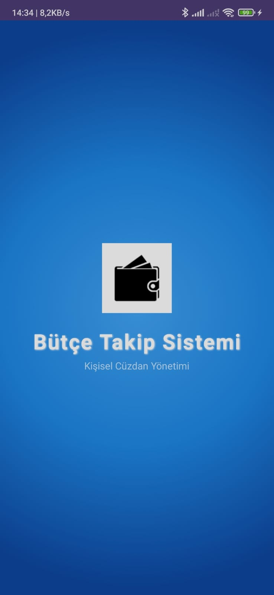
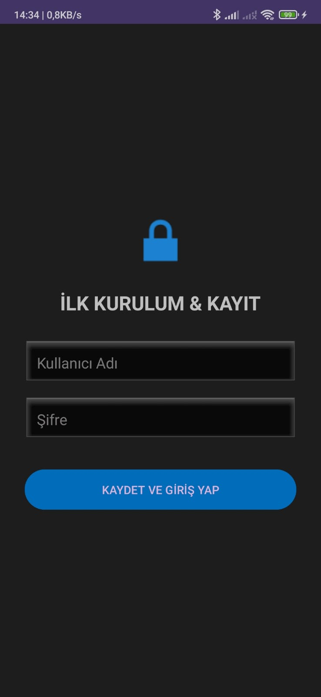
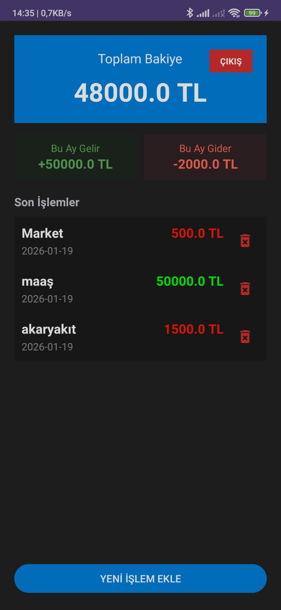
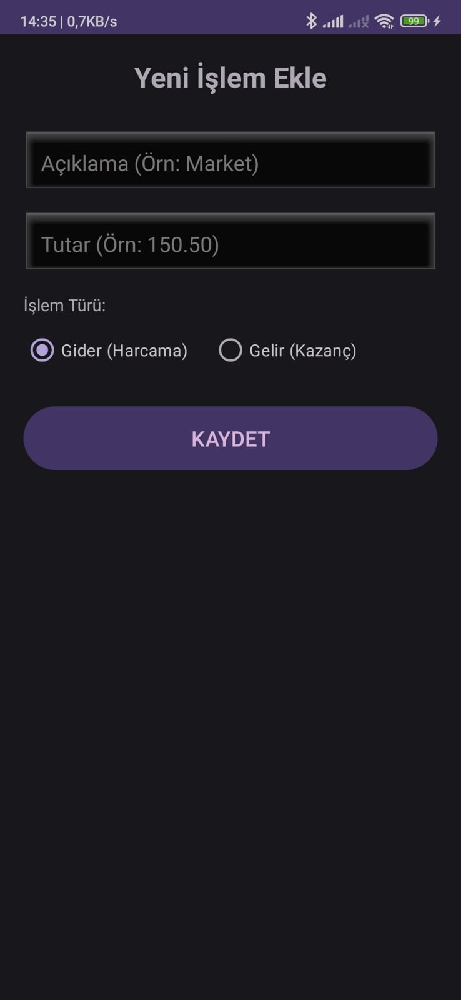

#  Bütçe Takip Sistemi (Budget Tracker)

Bu proje, kişisel gelir ve giderlerinizi takip etmenizi sağlayan, yerel veritabanı (SQLite) kullanan modern bir Android uygulamasıdır.

Kullanıcıların finansal durumlarını anlık olarak görüntülemesini, harcama ve gelirlerini kategorize etmesini ve güvenli bir giriş sistemiyle verilerini korumasını sağlar.

##  Ekran Görüntüleri

  
  
  
  

##  Özellikler

* **Güvenli Giriş:** Kullanıcı adı ve şifre ile yerel kimlik doğrulama.
* **CRUD İşlemleri:** Gelir/Gider ekleme, listeleme ve silme.
* **Anlık Hesaplama:** Toplam bakiye, aylık gelir ve giderin otomatik hesaplanması.
* **Kullanıcı Dostu Arayüz:** Modern tasarım, özel ikonlar ve temiz UX.
* **Veri Kalıcılığı:** SQLite veritabanı ile internet olmadan veri saklama.

##  Kullanılan Teknolojiler

* **Dil:** Kotlin
* **Platform:** Android (Min SDK: 24)
* **Veritabanı:** SQLite (Local Database)
* **Tasarım:** XML Layouts, Custom Shape Drawables
* **IDE:** Android Studio

##  Kurulum (APK)

Uygulamanın son sürümünü denemek için aşağıdaki linkten APK dosyasını indirebilirsiniz:
[Son Sürümü İndir (v1.0)](https://github.com/KULLANICI_ADIN/PROJE_ADIN/releases) 
##  Geliştirici

**[Senin Adın Soyadın]**
* LinkedIn: [Profil Linkin]
* Email: [Email Adresin]

---
*Bu proje Mobil Programlama dersi kapsamında geliştirilmiştir.*
